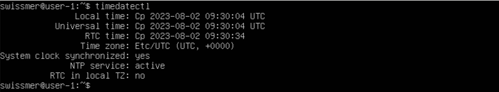
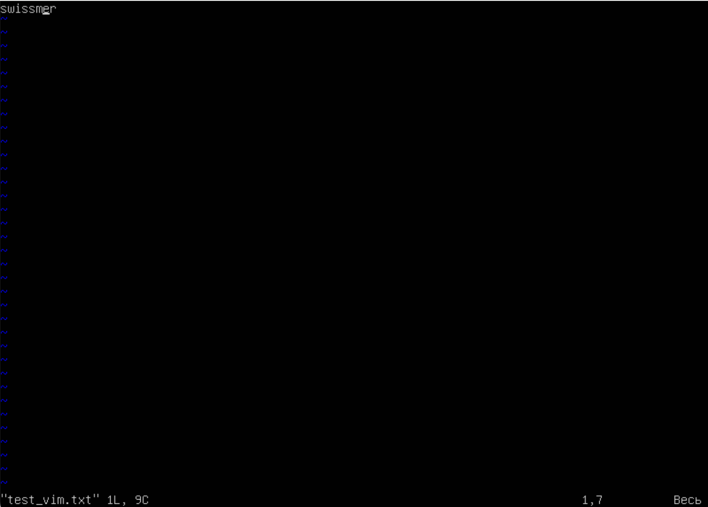
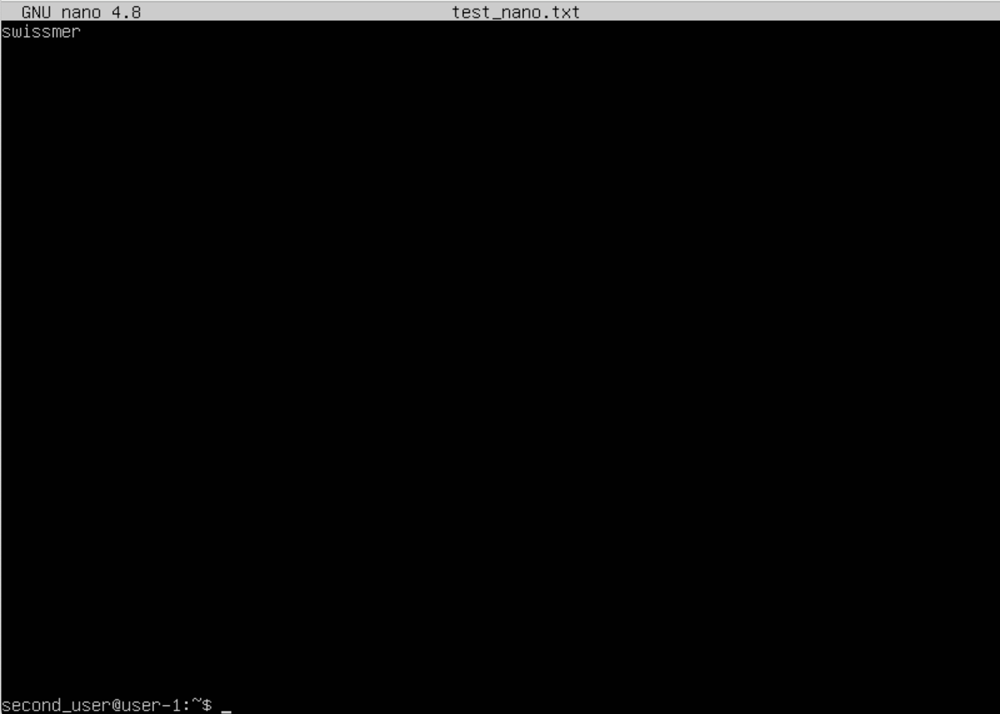
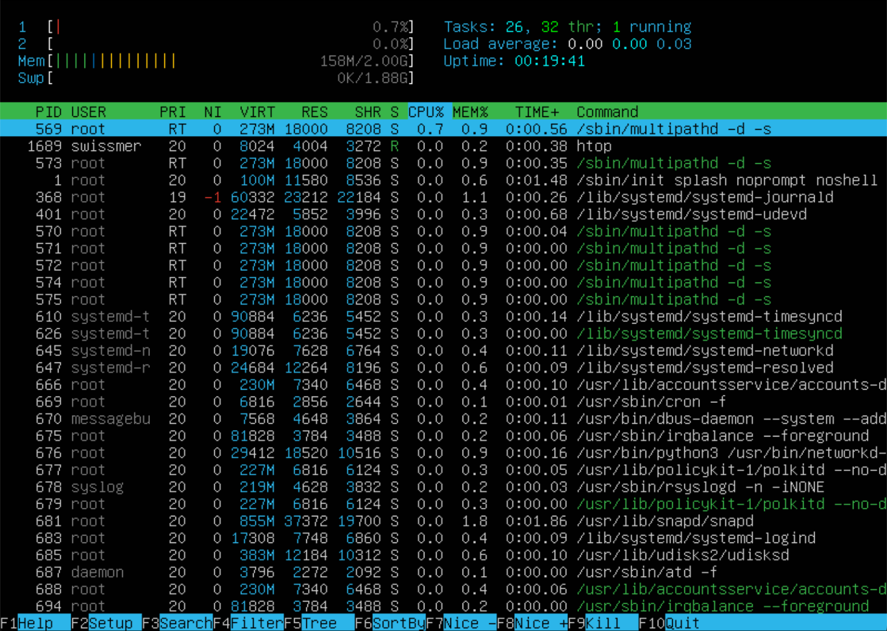
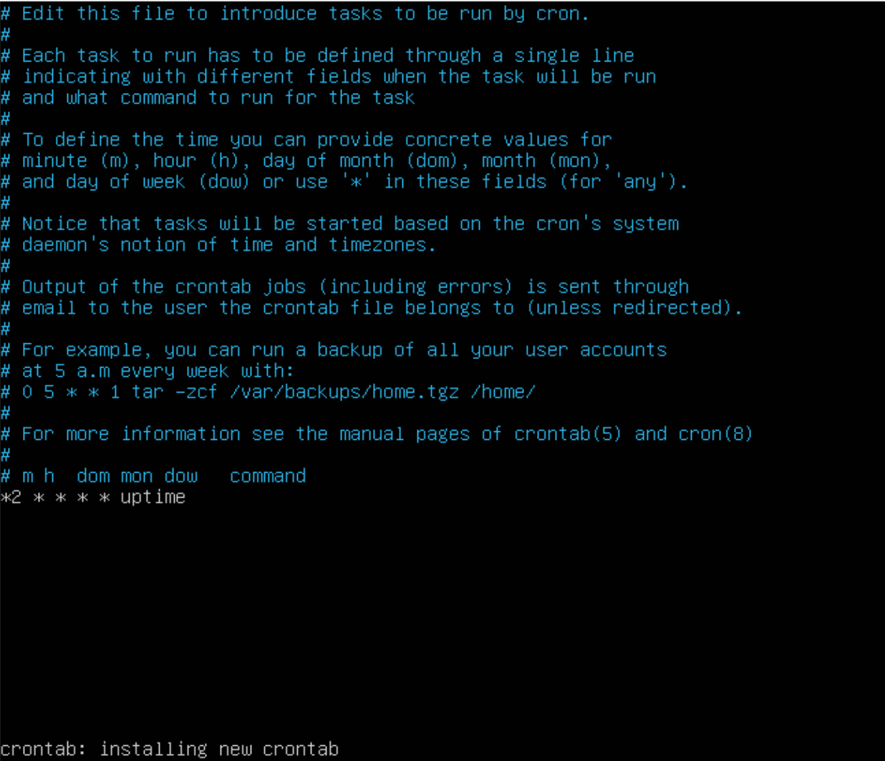

# Отчет

### Задание 1. Установка ОС

##### Установить **Ubuntu 20.04 Server LTS** без графического интерфейса. (Используем программу для виртуализации - VirtualBox)

* Графический интерфейс должен отсутствовать.

* Узнайте версию Ubuntu, выполнив команду cat /etc/issue.

* Вставьте скриншот с выводом команды.

*Версия установленной ОС*


### Задание 2. Создание пользователя

##### Создать пользователя, отличного от пользователя, который создавался при установке. Пользователь должен быть добавлен в группу `adm`.

*Создание пользователя через команду adduser, повторный вызов команды adduser с указанием пользователя и названием группы добавляет указанного пользователя в веденную группу*


*Информация о созданном пользователе*

* Новый пользователь должен быть в выводе команды cat /etc/passwd. Вставьте скриншот с выводом команды.


### Задание 3. Настройка сети ОС

* Задать название машины вида user-1.


* Установить временную зону, соответствующую вашему текущему местоположению.
*Просмотра текущего времени:* `timedatectl`



    Для просмотра доступных часовых 
    поясов выполнена команда* `timedatectl list-timezones`


    Далее установили часовой пояс
    при помощи:* `timedatectl set-timezone Europe/Moskow`


* Вывести названия сетевых интерфейсов с помощью консольной команды. В отчёте дать объяснение наличию интерфейса lo.

        Выполнена команда* `ip link show и ip a` 
        Для более полного вывода выполнена 
        команда `routel` * 


*lo (loopback device) – виртуальный интерфейс, присутствующий по умолчанию в любом Linux. Он используется для отладки сетевых программ и запуска серверных приложений на локальной машине. С этим интерфейсом всегда связан адрес 127.0.0.1. У него есть dns-имя – localhost.*

* Используя консольную команду получить ip адрес устройства, на котором вы работаете, от DHCP сервера. В отчёте дать расшифровку DHCP.

        Выполнена команда* `hostname -I`


 
*DHCP (англ. Dynamic Host Configuration Protocol — протокол динамической настройки узла) — сетевой протокол, позволяющий сетевым устройствам автоматически получать IP-адрес и другие параметры, необходимые для работы в сети TCP/IP.* 

* Определить и вывести на экран внешний ip-адрес шлюза (ip) и внутренний IP-адрес шлюза, он же ip-адрес по умолчанию (gw).

        Внешний ip-адрес шлюза можно получить
        с помощью команды и сайта icanhazip.com 
        `curl icanhazip.com`.

        Внутренний ip-адрес может быть 
        получен с помощью команды* `ip r`.


* Задать статичные (заданные вручную, а не полученные от DHCP сервера) настройки ip, gw, dns (использовать публичный DNS серверы, например 1.1.1.1 или 8.8.8.8).

        Редактируем файл настроек:
        `sudo nano /etc/netplan/00-installer-config.yaml`.


    Применяем изменения:* `sudo netplan apply`

* Перезагрузить виртуальную машину. Убедиться, что статичные сетевые настройки (ip, gw, dns) соответствуют заданным в предыдущем пункте.

        Перезагружаем машину:* `reboot`
        Проверяем параметры:* `routel`


* В отчёте опишите, что сделали для выполнения всех семи пунктов (можно как текстом, так и скриншотами).
Успешно пропинговать удаленные хосты 1.1.1.1 и ya.ru и вставить в отчёт скрин с выводом команды. В выводе команды должна быть фраза "0% packet loss".

        `ping 1.1.1.1 и ping ya.ru`


### Задание 4. Обновление ОС

* Обновить системные пакеты до последней на момент выполнения задания версии.
После обновления системных пакетов, если ввести команду обновления повторно, должно появится сообщение, что обновления отсутствуют.
Вставить скриншот с этим сообщением в отчёт.

        `sudo apt upgrade`


### Задание 5. Использование команды sudo

* Разрешить пользователю, созданному в Part 2, выполнять команду sudo

        `sudo usermod -aG sudo second_user`

* Поменять hostname ОС от имени пользователя, созданного в пункте Part 2 (используя sudo).

        su - second_user
        sudo hostnamectl set-hostname user-2

* Вставить скрин с изменённым hostname в отчёт.


* В отчёте объяснить истинное назначение команды sudo (про то, что это слово - "волшебное", писать не стоит).

*Команда sudo (substitute user and do - подменить пользователя и выполнить) - позволяет пользователям выполнять команды от имени суперпользователя root. В зависимости от настроек, утилита sudo попросит ваш пароль для входа или вообще откажется работать, сказав, что у вас нет права ее использовать. Как правило, в Ubuntu sudo спрашивает пароль и запоминает его на пять минут. На протяжении этого времени вы можете использовать sudo, не вводя пароль каждый раз.*


### Задание 6. Установки и настройка службы времени

* Настроить службу автоматической синхронизации времени.
Вывести время, часового пояса, в котором вы сейчас находитесь.
Вывод следующей команды должен содержать NTPSynchronized=yes: timedatectl show.
Вставить скрины с корректным временем и выводом команды в отчёт.

        `sudo timedatectl set-ntp on`
        `timadatectl show` 


### Задание 7. Установка и использование текстовых редакторов

* Установить текстовые редакторы VIM (+ любые два по желанию NANO, MCEDIT, JOE и т.д.)

        sudo apt install vim
        sudo apt install nano
        sudo apt install joe


* Используя каждый из трех выбранных редакторов, создайте файл test_X.txt, где X -- название редактора, в котором создан файл. Напишите в нём свой никнейм, закройте файл с сохранением изменений.
В отчёт вставьте скриншоты:\
Из каждого редактора с содержимым файла перед закрытием.\
В отчёте укажите, что сделали для выхода с сохранением изменений.

* *Создание файла test_vim.txt:*

    1. `vim test_vim.txt`
    2. *В режиме редактирования вписываем ник и выходим из режима редактирования, нажав* `Esc`
    3. *Выход с сохранение изменений = * `:wq` *- запись и сохранение изменений*\


 * *Создание файла test_nano.txt:*
    1. `nano test_nano.txt`
    2. *Вписываем ник и выходим из редактора, сочетание клавиш `control + x` указано в интерфейса самого редактора*, сохранение изменений необходимо подтвердить клавишей * `y`\


* *Создание файла test_joe.txt:*
    1. `joe test_joe.txt`
    2. * *Вписываем ник и выходим с сохранением изменений, сначала необходимо как в вим войти в режим команд сочетанием* `control + k` *после чего выйти с сохранинием изменений клавишей* `x`\


* Используя каждый из трех выбранных редакторов, откройте файл на редактирование, отредактируйте файл, заменив никнейм на строку "21 School 21", закройте файл без сохранения изменений.

* В отчёт вставьте скриншоты:

Из каждого редактора с содержимым файла после редактирования.

* В отчёте укажите, что сделали для выхода без сохранения изменений.

    *Редактирование файла test_vim.txt:*
    `vim test_vim.txt`
    *В режиме редактирования вписываем '21 School 21' и выходим из режима редактирования, нажав* `Esc`
    *Выход с сохранение изменений = * `:q!` *- запись и сохранение изменений*\


    * *Редактирование файла test_nano.txt:*
    *Открываем* `nano test_nano.txt`
    *Вписываем '21 School 21' вместо никнейма и выходим из редактора, сочетание клавиш `control + x` указано в интерфейса самого редактора*, сохранение изменений можно не подтверждать клавишей * `n`\


    * *Редактирование файла test_joe.txt:*
    *Открываем* `joe test_joe.txt`
    *Вписываем '21 School 21' и выходим без сохранения изменений нажав* `control + c`* и *`y`\


* Используя каждый из трех выбранных редакторов, отредактируйте файл ещё раз (по аналогии с предыдущим пунктом), а затем освойте функции поиска по содержимому файла (слово) и замены слова на любое другое.

* В отчёт вставьте скриншоты:
Из каждого редактора с результатами поиска слова.\
Из каждого редактора с командами, введёнными для замены слова на другое.

    * *test_vim.txt:*
    *Для осуществления поиска необходимо выйти из режима редактирования и прописать:* `/`*, после слеш необходимо вписать любое значение, которое необходимо найти:*\


    * *test_nano.txt:*
    *Команда для поиска по файлу отображается в интерфейсе программы* `control + w`*\


    * *test_joe.txt:*
    *Поиск осуществляется слева-направо по содержимомому файла, для корректной работы поиска необходимо установить указатель на начало файла, после чего сочением клавишь перейти в режим ввода команд и открыть режим поиска по тексту* `control + k`*,* `f`*, <значение для поиска>, Enter*\


### Задание 8. Установка и базовая настройка сервиса SSHD

* Установить службу SSHd. 

        `sudo apt-get install ssh`
        `sudo apt install openssh-server`


* Добавить автостарт службы при загрузке системы.
    
        `sudo systemctl enable sshd`

    Посмотрим работает ли: 

        `systemctl status sshd`

    Скриншот ниже


* Перенастроить службу SSHd на порт 2022.
     
        `sudo vim /etc/ssh/sshd_config`

    Скриншот ниже


    Перезапускаем SSH-сервер:
    
        `systemctl restart sshd`

    Скриншот ниже
    


* Используя команду ps, показать наличие процесса sshd. Для этого к команде нужно подобрать ключи.
  В отчёте объяснить значение команды и каждого ключа в ней.

    * *Системная утилита ps отвечает за отображение процессов на экране пользователя.
    Ключи, помогающие выбрать нужные процессы для отображения их состояний:\
    -A, -e, (a) - выбрать все процессы;\
    -a - выбрать все процессы, кроме фоновых;\
    -d, (g) - выбрать все процессы, даже фоновые, кроме процессов сессий;\
    -N - выбрать все процессы кроме указанных;\
    -С - выбирать процессы по имени команды;\
    -G - выбрать процессы по ID группы;\
    -p, (p) - выбрать процессы PID;\
    --ppid - выбрать процессы по PID родительского процесса;\
    -s - выбрать процессы по ID сессии;\
    -t, (t) - выбрать процессы по tty;\
    -u, (U) - выбрать процессы пользователя.*

    * *Ключи форматирования:\
    -с - отображать информацию планировщика;\
    -f - вывести максимум доступных данных, например, количество потоков;\
    -F - аналогично -f, только выводит ещё больше данных;\
    -l - длинный формат вывода;\
    -j, (j) - вывести процессы в стиле Jobs, минимум информации;\
    -M, (Z) - добавить информацию о безопасности;\
    -o, (o) - позволяет определить свой формат вывода;\
    --sort, (k) - выполнять сортировку по указанной колонке;\
    -L, (H)- отображать потоки процессов в колонках LWP и NLWP;\
    -m, (m) - вывести потоки после процесса;\
    -V, (V) - вывести информацию о версии;\
    -H - отображать дерево процессов;*

    * *Выводим на экран процессы sshd с помощью команды* `ps -C sshd`\
    
    

* Перезагрузить систему.

* В отчёте опишите, что сделали для выполнения всех пяти пунктов (можно как текстом, так и скриншотами).
Вывод команды netstat -tan должен содержать  
tcp 0 0 0.0.0.0:2022 0.0.0.0:* LISTEN  
(если команды netstat нет, то ее нужно установить)
Скрин с выводом команды вставить в отчёт.
В отчёте объяснить значение ключей -tan, значение каждого столбца вывода, значение 0.0.0.0.

    * *Команда netstat отображает информацию о сети, такую как: сетевые подключения, статиcтику интерфейсов, таблицы маршрутизации и т.д. Oпции -tan:
        * -t - отображение текущего подключения в состоянии переноса нагрузки с процессора на сетевой адаптер при передаче данных
        * -a - вывод информации о всех сокетах(об активных которые слушают порты и неактивных, которые не слушают)
        * -n - показывает сетевые адреса как числа
    * Столбцы вывода:
        * Proto: имя протокола
        * Recv-Q - количество полученных пакетов в очереди
        * Send-Q - количество отправленных пакетов в очереди
        * Local Address - IP-адрес локального компьютера и номер используемого порта
        * Foreign Address - IP-адрес и номер порта удаленного компьютера, к которому подключен сокет
        * State - состояние TCP-соединения
    * Локальный адрес - локальный IP-адрес участвующий в соединении или связанный со службой, ожидающей входящие соединения (слушающей порт). Если в качестве адреса отображается `0.0.0.0` , то это означает - "любой адрес", т.е в соединении могут использоваться все IP-адреса существующие на данном компьютере*\ 

    Так как этой команды нет, пришлось установить:
    
        `sudo apt install net-tools`

    Скриншот ниже
    
    


### Задание 9. Установка и использование утилит top, htop

* Установить и запустить утилиты top и htop.


* По выводу команды top определить и написать в отчёте:
    * uptime
    * количество авторизованных пользователей
    * общую загрузку системы
    * общее количество процессов
    * загрузку cpu
    * загрузку памяти
    * pid процесса занимающего больше всего памяти
    * pid процесса, занимающего больше всего процессорного времени

*uptime (время работы после загрузки) —  17 минут*

    количество авторизованных пользователей — 1
    общая загрузка системы 
    (за последние 1, 5 и 15 минут) — 0,00, 0,01, 0,04
    общее количество процессов — 104
    загрузка cpu — 0,0
    загрузка памяти — 2043.2
    pid процесса, занимающего больше всего памяти — 1
    pid процесса, занимающего больше всего
    процессорного времени — 1


* В отчёт вставить скрин с выводом команды htop:

    отсортированному по PID, PERCENT_CPU, PERCENT_MEM, TIME

    *Интерфейс htop показывает, что для сортировки по столбцам необходимо нажать клавишу* `F6` *после чего выбирать нужную категорию.*\

    

    

    

    

    * отфильтрованному для процесса sshd

    *`F4` - в поле для фильтра необходимо указать* `sshd`\

    

    * с процессом syslog, найденным, используя поиск

    *`F3` в поле для поиска необходимо указать процесс* `syslog`\
    
    

    * с добавленным выводом hostname, clock и uptime

        `F2` - из категории Available meters, выбрать параметр и поместить в необхдимую колонку вывода
    
        Для clock.
    
        Скриншот ниже
    
        

        Для uptime. Настройка там же, где и clock.

        Для hostname. Там же.

        


### Задание 10. Использование утилиты fdisk

* Запустить команду fdisk -l. (В отчёте написать название жесткого диска, его размер и количество секторов, а также размер swap.)

    Название:  /dev/sda, размер: 15GiB, количеств
    'секторов:  31457280, размер swap: 1,9G


### Задание 11. Использование утилиты df

* Запустить команду df.

* В отчёте написать для корневого раздела (/):

        размер раздела 10218772
        размер занятого пространства 4667432
        размер свободного пространства 5010668
        процент использования 49%


* Определить и написать в отчёт единицу измерения в выводе.

        Kb (по 1 килобайту)

* Запустить команду df -Th.


* В отчёте написать для корневого раздела (/):

        размер раздела 9,8G
        размер занятого пространства 4,5G
        размер свободного пространства 4,8G
        процент использования 49%

* Определить и написать в отчёт тип файловой системы для раздела.

        ext4

### Задание 12. Использование утилиты du

* Запустить команду du.

    

* Вывести размер папок /home, /var, /var/log (в байтах, в человекочитаемом виде)

    ```
    sudo du -hs -B KB /home
    sudo du -hs -B KB /var 
    sudo du -hs -B KB /var/log
    ```

    


* Вывести размер всего содержимого в /var/log (не общее, а каждого вложенного элемента, используя `*`)

    

* В отчёт вставить скрины с выводом всех использованных команд.


### Задание 13. Установка и использование утилиты ncdu

* Установить утилиту ncdu.


* Вывести размер папок /home, /var, /var/log.


* Размеры должны примерно совпадать с полученными в Part 12.


* В отчёт вставить скрины с выводом использованных команд.

    ```
    sudo ncdu /home
    sudo ncdu /var
    sudo ncdu /var/log
    ```
    
    
    


### Задание 14. Работа с системными журналами

* Открыть для просмотра (Для более удобного чтения файлов с возможностью пролистывания и переключения между файлами - была установлена утилита most):


    */var/log/dmesg


    */var/log/syslog


    */var/log/auth.log


* Написать в отчёте время последней успешной авторизации, имя пользователя и метод входа в систему.


* Перезапустить службу SSHd.
* Вставить в отчёт скрин с сообщением о рестарте службы (искать в логах).

        *Имя пользователя - user-2*
        *`most /var/log/syslog`\
        *Рестарт в 17:34:18*\
    

### Задание 15. Использование планировщика заданий CRON

* Используя планировщик заданий, запустите команду uptime через каждые 2 минуты.
* Найти в системных журналах строчки (минимум две в заданном временном диапазоне) о выполнении.
* Вывести на экран список текущих заданий для CRON.
* Вставить в отчёт скрины со строчками о выполнении и списком текущих задач.
* Удалите все задания из планировщика заданий.
* В отчёт вставьте скрин со списком текущих заданий для CRON.

    `sudo crontab -e` *- открывается (создаётся) список задач. Строка формата* `*/2 * * * * uptime` *устанавливается сценарий запуска команды uptime каждые 2 минуты.*\

    


    `sudo crontab -l` *- лист текущих заданий cron*

    

    *`sudo crontab -r` - удаление всех заданий из планировщика заданий*\
    
    